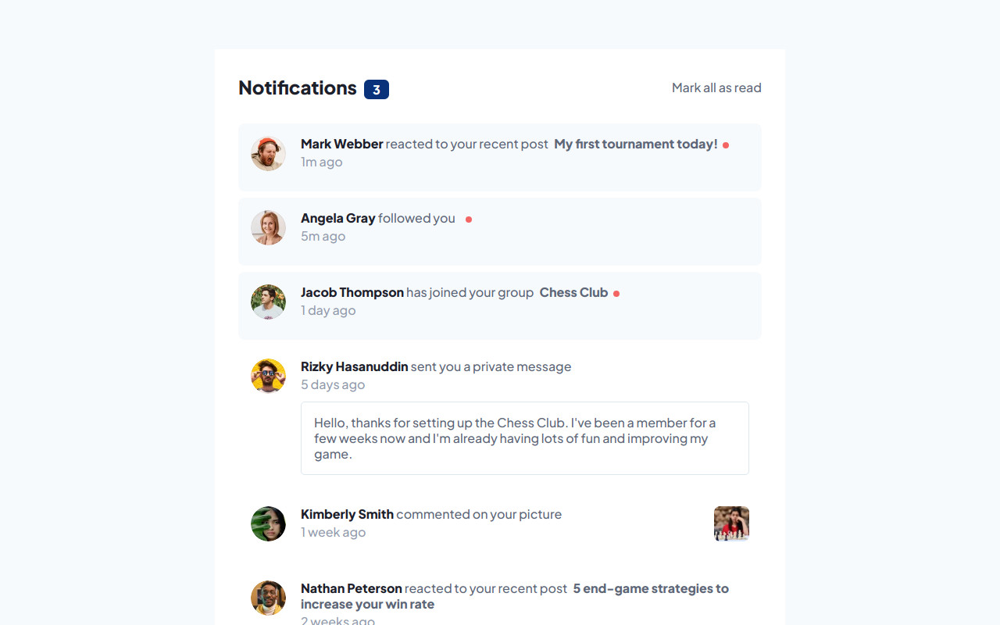

# Frontend Mentor - Notifications page solution

This is a solution to the [Notifications page challenge on Frontend Mentor](https://www.frontendmentor.io/challenges/notifications-page-DqK5QAmKbC). Frontend Mentor challenges help you improve your coding skills by building realistic projects. 

## Table of contents

- [Overview](#overview)
  - [The challenge](#the-challenge)
  - [Screenshot](#screenshot)
  - [Links](#links)
- [My process](#my-process)
  - [Built with](#built-with)
  - [What I learned](#what-i-learned)
  - [Continued development](#continued-development)
  - [Useful resources](#useful-resources)
- [Author](#author)


## Overview

### The challenge

Users should be able to:

- Distinguish between "unread" and "read" notifications
- Select "Mark all as read" to toggle the visual state of the unread notifications and set the number of unread messages to zero
- View the optimal layout for the interface depending on their device's screen size
- See hover and focus states for all interactive elements on the page

### Screenshot



### Links

- Solution URL: [https://www.frontendmentor.io/solutions/notifications-page-7oZwTa1-QG](https://www.frontendmentor.io/solutions/notifications-page-7oZwTa1-QG)
- Live Site URL: [https://notifications-page-neon.vercel.app/](https://notifications-page-neon.vercel.app/)

## My process

### Built with

- Semantic HTML5 markup
- Sass
- Mobile-first workflow
- [React](https://reactjs.org/) - JS library

### What I learned

I struggled coming up with a way to represent the unread state notifications that was able to work with the notifications count and with the 'mark all as read' button. I came up with the following object and two react states.
```js
var initial = {
indexes: notificationsData.data.map((el, index) => index < 3),
         count: undefined,
         updateCount: function () {
           this.count = this.indexes.reduce((acc, isUnread) => acc + isUnread, 0);
         },
};
initial.updateCount();
var [unread, setUnread] = useState(initial);
var [count, setCount] = useState(unread.count);
```

### Continued development

I need to learn about React patterns.

### Useful resources

- [Array.prototype.fill()](https://developer.mozilla.org/en-US/docs/Web/JavaScript/Reference/Global_Objects/Array/fill) - I used it on the 'mark all as read' logic
- [How to focus on a non input element?](https://chsamii.medium.com/how-to-focus-on-a-non-input-element-96db50b36e97) - This helped me to make the li elements for the notifications to be focusable with tab so that the onBlur event would work better.

## Author

- Frontend Mentor - [@miguelzaga](https://www.frontendmentor.io/profile/miguelzaga)

